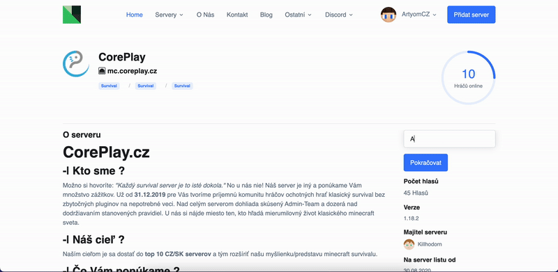

# Hlasování

Každý uživatel může jednou za 24 hodin hlasovat, stačí být přihlášený a zobrazit si detailní stránku daného serveru. Servery s nejvíce hlasy se budou zobrazovat na hlavní stránce a získají lepší umístění na server listu.

Hlasy se serveru vynulují vždy jednou za 30 dní, ode dne kdy byl server přidán na server list.

## FAQs

Proč mi nejde hlasovat?

Zkontroluj že jsi přihlášený ke svému účtu.

Proč nemohu vyplnit nick/lze jen odeslat hlas?

Pokud server nemá nastavené odměny za hlasování nick se nevyplňuje.

## Související články


[odme-ny-za-hlasovani-votifier.md](../spravci-serveru/odme-ny-za-hlasovani-votifier.md)


**Něco nám uniklo?**

Nebojte se! Rádi poradíme na [Discordu](https://discord.mcservery.eu) nebo [info@mcservery.eu](mailto:info@mcservery.eu) ✌️
