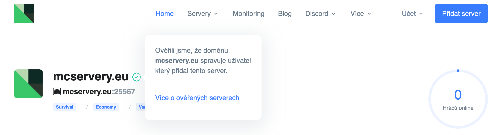

# Ověřený server

Aby se zobrazil odznak "Ověřeno", musí se webové stránky uvedené v profilu Minecraft serveru shodovat s ověřenou doménou. Doména se ověřuje pomocí umístění zpětného odkazu, který odkazuje na doménu https://mcservery.eu.

Aby bylo možné ověřit vaši doménu je nutné, aby byla uvedena v poli "Web serveru", to je možné vyplnit při přidání serveru, nebo editaci již přidaného serveru. Přidané odkazy např. v popisu serveru, nejsou pro toto ověření způsobilé.

<figure><figcaption>
Odznak ověřeného serveru
</figcaption></figure>

### Jak přidat zpětný odkaz?

Postupujte dle [tohoto návodu](https://help.mcservery.eu/spravci-serveru/zpe-tny-odkaz#jak-postupovat-pri-registraci-noveho-serveru), kde je postup, u již přidaného serveru, tak i pro případ že nový server teprve přidáváte na server list.


V případě že zpětný odkaz po ověření odstraníte, bude vám automaticky odebrán i odznak "Ověřeno".


## Související články


[pr-idani-noveho-serveru.md](../pr-idani-noveho-serveru.md)



[.](./)


**Něco nám uniklo?**

Nebojte se! Rádi poradíme na [Discordu](https://discord.mcservery.eu) nebo [info@mcservery.eu](mailto:info@mcservery.eu) ✌️
